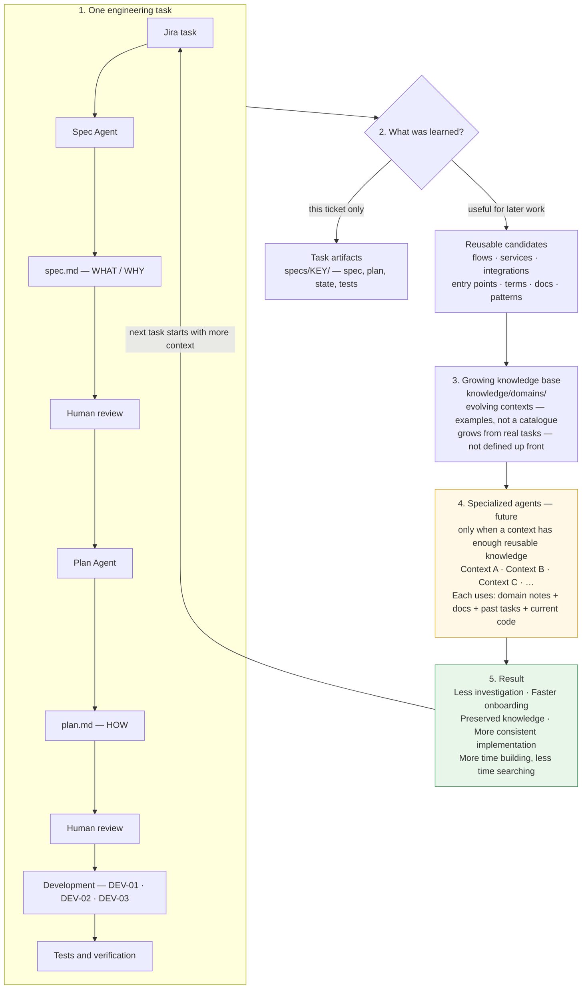

# onedome-engineering-sdd

Cursor-driven Spec-Driven Development (SDD) for OneDome **backend** work.

This repository is the control plane: specs, plans, task state, agents, and (over time) reusable domain knowledge. Application source stays in the application git repos. Open this repo in the same Cursor workspace as those checkouts.

## Why this exists

OneDome is a large system: many services, integrations, and business domains. New developers join regularly.

A lot of time is spent on investigation, not on writing code:

- how a business flow works
- which repositories and services are involved
- where a change should live
- how an integration behaves
- where the relevant docs and previous decisions are

The goal is to **stop rediscovering the same context**. Every completed task should leave useful artifacts behind, so the next developer or agent in that area starts with more knowledge than the last one.

SDD is backend-only. Specs, plans, and implementation cover server-side services, APIs, jobs, and backend rules — not screens or client apps.

## How this becomes more valuable over time

One of the main problems we want to solve is repeated investigation. In a large multi-service system, developers — especially new team members — can spend significant time finding the right context, services, integrations and documentation before implementation even starts.

The goal of this approach is to make every completed task improve the context available for the next one.



AI helps investigate, specify, plan, implement and test. Humans approve the important decisions. Not everything from a task is kept: only reusable facts are curated into `knowledge/`. Task folders stay the history of that ticket.

A bounded-context agent is **not** an agent for one git repository. A business context may span several services, integrations and docs; one service may also sit in several contexts. Agents appear only when a context has enough reusable knowledge. They must still verify important behaviour against current source code. There are no domain agents in this repository yet.

**Expected direction** if the framework is used consistently — not a guarantee or a metric:

| | What we expect |
| --- | --- |
| **Now** | SDD is in use. The knowledge base is small. Investigation is still mostly manual. |
| **After ~3 months** | Several domains have notes. Known areas need less hunting. Docs are easier to find. New joiners have a better starting point. |
| **After ~6 months** | A usable knowledge base. First mature bounded-context agents. Faster investigation in known domains. More consistent implementation. |
| **Long term** | Several domain agents. An orchestrator routes work to the right context. Cross-domain context can be combined. More time implementing, less time searching. |

Example — a completed ticket can leave reusable notes under `knowledge/domains/<context>/` when the same area is likely to recur. Later tasks in that area add to it. A specialized agent is considered only after that context is mature.

Management-friendly diagram of the same strategy: [docs/engineering-knowledge-strategy.md](docs/engineering-knowledge-strategy.md).

## Current workflow

```text
Jira Task
    ↓
Spec Agent
    ↓
spec.md — WHAT / WHY
    ↓
Human Review & Approval
    ↓
Plan Agent
    ↓
plan.md — HOW
    ↓
Human Review & Approval
    ↓
/sdd-pr  (spec/plan on GitHub, linked from Jira)
    ↓
/start-development  →  DEV breakdown  →  human approval
    ↓
continue  →  implement one DEV  →  tests  →  I accept this subtask  (repeat)
    ↓
/finish-development
```

Requirements come from the **Nuclino page** on the Jira issue, plus attachments or files the human provides. Jira is a locator (key, title, links, attachments). Labels are ignored. **Source code** is the source of truth for current behaviour.

### Spec Agent

`.cursor/agents/spec-agent.md`

Given one Jira key, it asks which backend repos to inspect and whether there are extra sources, then reads Nuclino, confirmed docs, and only those named checkouts. It writes `specs/<JIRA-KEY>/spec.md` (WHAT / WHY). Missing information becomes an **Open Question**. It does not invent behaviour, plan, or implement.

A human who has enough product/domain context approves in chat. Job title does not matter.

### Plan Agent

`.cursor/agents/plan-agent.md`

Runs only after the spec is approved. It inspects current code, names affected repositories (ids from `config/repositories.yaml`), and writes `specs/<JIRA-KEY>/plan.md` (HOW): changes, sequencing, tests, risks. It does not change approved WHAT and does not implement.

A human approves the plan in chat.

### Development

`.cursor/skills/sdd-development/SKILL.md`

The AI proposes **2–7** DEV items by technical cohesion (not one-per-file). The human reviews the list. Implementation is one subtask at a time:

```text
DEV-01  →  implementation  →  tests  →  review
DEV-02  →  implementation  →  tests  →  review
DEV-03  →  …
```

That keeps a Jira ticket from becoming one uncontrolled change.

| You type | What happens |
| --- | --- |
| `/start-development <KEY>` | Propose DEV-01…DEV-0n, then stop. On resume: status only, no new breakdown. |
| `I approve the development breakdown` | Persist the list; create/reuse `feature/<KEY>` in each `impact: change` checkout. |
| `continue` | Implement the current DEV; run narrow tests; summarise. **No commit.** |
| `I accept this subtask` | Mark that DEV completed; **one commit per listed app repo**. No push unless asked. |
| `/finish-development <KEY>` | `lifecycle: in_review`, `development.status: implementation_complete`. |

`/sdd-pr` opens a PR in **this** repo on `sdd/<KEY>` (Jira key in title and body). It does not open application PRs or change Jira status.

If a mapping is not obvious from spec, plan, workbook, or code: ship the evidenced subset and leave `// TODO(dev): …`. Do not invent Dataverse names or product behaviour.

## Human responsibility

AI helps with investigation, specification, planning, implementation, and tests.

Humans:

- approve the spec, the plan, and the DEV breakdown
- accept each implemented subtask (that is when application code is committed)
- review generated code

AI must not invent missing business behaviour. Conversational `ok` / `lgtm` is not approval.

**Gates (verbatim):** `I approve this spec`, `I approve this plan`, `I approve the development breakdown`, `I accept this subtask`.

## Multi-repository

One business task can touch several services. `config/repositories.yaml` is the catalog of known checkouts (`id` + path). Spec and plan name which of those are in play (`impact: change` vs `read`).

Implementation happens in those application repos, on `feature/<JIRA-KEY>`. This SDD repo holds the spec, plan, and state — not the application source.

## Knowledge accumulation

Each task leaves history under:

```text
specs/<JIRA-KEY>/
  spec.md
  plan.md
  task-state.yaml
  knowledge/sources.md    # intake: named repos, Nuclino, attachments
```

That describes **one ticket**. During the work we also learn things that will help the *next* ticket: how a flow works, which services participate, integration quirks, terminology, useful entry points, vendor docs.

Reusable notes belong under `knowledge/` once they are verified — for example:

```text
knowledge/domains/sourcing/
```

Folders `knowledge/domains/`, `architecture/`, `integrations/`, and `services/` exist today. They are empty until a completed task produces a real note. We do not document the whole system up front. Knowledge grows from real tasks.

Treat `knowledge/` as possibly stale. Verify material claims against source code before relying on them.

### Agent vs knowledge

| | Role |
| --- | --- |
| Agent (`.cursor/agents/`) | How to investigate and reason |
| `knowledge/` | Reusable facts, maps, and doc links |

Do not dump a whole domain into an agent prompt. Keep agents small; let domain notes evolve independently.

### Documentation references

Useful links found while working (Nuclino, Confluence, vendor/API docs) are part of the knowledge base. A useful reference says what the document is, which topic it covers, why it helps, and when it was last checked if you know that.

Per-task links start in `specs/<KEY>/knowledge/sources.md`. Promote them into `knowledge/` only if they will help future work.

### Collect during development, curate after

During a DEV, possible reusable facts go into `task-state.yaml` → `development.knowledge_candidates`. Do not rewrite `knowledge/` mid-implementation.

After `/finish-development`, keep only what is genuinely useful for the next person. If nothing reusable was learned, leave `knowledge/` unchanged.

## Feedback loop

The diagram above is the loop. Today the implemented path stops at collecting candidates during development and writing verified notes after the task. Bounded-context agents are the intended next step.

## Repository structure

```text
.cursor/agents/          spec-agent, plan-agent
.cursor/commands/        /sdd-pr, /start-development, /finish-development
.cursor/skills/          sdd-pr, sdd-development (the actual procedures)
.cursor/rules/           sdd-governance.mdc — always-on policy
specs/<JIRA-KEY>/        historical artifacts for one ticket
knowledge/               reusable notes (empty until tasks fill it)
config/repositories.yaml checkout catalog
config/workflow.yaml     git patterns, lifecycle enum, MCP settings
templates/               spec.md, plan.md, task-state.yaml
```

Policy lives in `.cursor/rules/`. Environment values live in `config/`.

## task-state.yaml

Machine state for one ticket, copied from `templates/task-state.yaml`. Not a second spec.

It records, among other fields:

- `lifecycle.status` — e.g. `specifying` → `spec_approved` → `plan_approved` → `in_development` → `in_review`
- spec/plan approval (`approved_by`, `approved_at`, `method: chat`) and SDD PR URL
- `repositories[]` — `id`, `path`, `branch`, `impact`, optional implementation PR
- `development.status`, `decomposition`, `current_subtask`, `subtasks[]` (DEV-01…)
- `knowledge_candidates[]` (during work) and `knowledge_updates[]` (after curation)
- `sdd.branch` — `sdd/<JIRA-KEY>`

`development.status: implementation_complete` is not a lifecycle value.

## Current vs future

### Current

- Spec agent and plan agent, with human chat gates
- Open Questions instead of invented behaviour
- `/sdd-pr` for this repo; application branches `feature/<KEY>` after breakdown approval
- Incremental DEV loop with tests, accept, then commit
- Backend-only delivery
- Checkout catalog and per-task state
- Knowledge *collection* (`knowledge_candidates`, per-task `sources.md`)
- Knowledge *folders* ready under `knowledge/`

### Future direction

```text
Accumulated domain knowledge
        ↓
Mature bounded contexts
        ↓
Specialized agents where knowledge is sufficient
        ↓
eventually context routing / orchestration
        ↓
faster investigation and development
```

A bounded-context agent is **not** “an agent for one git repo”. A business context may span several services. When enough reusable notes exist under `knowledge/domains/<context>/`, a specialized agent can start from that knowledge plus docs, previous `specs/`, and **current source code**. It must still verify important behaviour against code.

Do not create those agents before enough knowledge exists. There are no domain agents in this repository today.

## Developer quick start

You have a Jira key. This repo and the relevant application checkouts are open in Cursor.

1. Run **spec-agent** with the key. Answer which backend repos to inspect and any extra docs.
2. Read `specs/<KEY>/spec.md`. If it is right: `I approve this spec`.
3. Run **plan-agent**. Read `plan.md`. If it is right: `I approve this plan`.
4. `/sdd-pr`
5. `/start-development <KEY>` — review the DEV list.
6. `I approve the development breakdown`
7. `continue` → review the diff and tests → `I accept this subtask` → repeat until DEV items are done.
8. `/finish-development <KEY>`
9. If something will help the next ticket, add a short verified note under `knowledge/` (for example `knowledge/domains/<domain>/`). Skip this if nothing reusable was learned.

Application push/PRs are a separate, explicit ask after finish.
