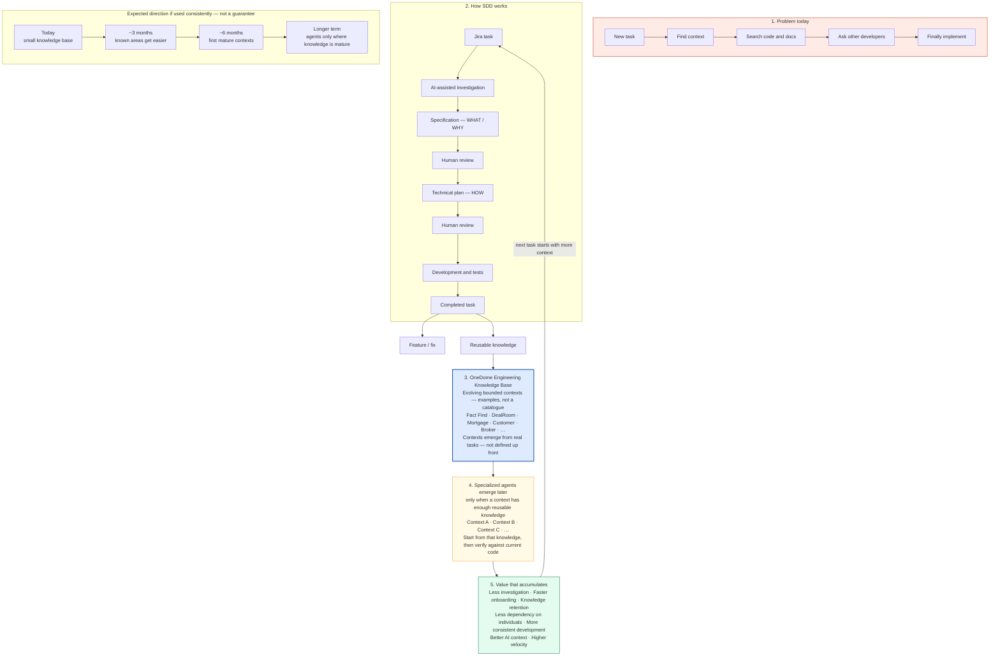

# OneDome SDD and Engineering Knowledge

Management view of the strategy. Technical workflow: [README](../README.md).

Confluence: [SDD — engineering knowledge strategy](https://onedome.atlassian.net/wiki/spaces/Engineerin/pages/768933915/SDD+engineering+knowledge+strategy).

We are not only using AI to implement individual tasks. We are building reusable OneDome engineering knowledge.

Today, developers — especially new team members — can spend significant time finding context and understanding where a change belongs. Each completed task should contribute useful reusable knowledge, not only a feature or a fix.

OneDome contains many different business and technical contexts. We do not need to define all of them up front. As engineering tasks are completed, recurring areas of knowledge will naturally become visible. Useful knowledge is accumulated around those areas, and some may eventually become mature bounded contexts. When a context contains enough reusable knowledge, a specialized agent can use it as a starting point for future work while still verifying current behaviour against the source code. We do not create an agent just because we can name a business area.

A bounded context is not the same as a Git repository. A business context may span several services, repositories, integrations, APIs and documentation. One service may also participate in several contexts. Future agents are organized around that useful knowledge boundary, not around `hub-service` or `integration-service`.

The expected result is less repeated investigation, easier onboarding, knowledge that is not trapped in a few people's heads, better AI context, and more time spent implementing.

